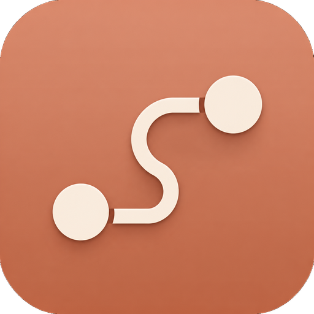
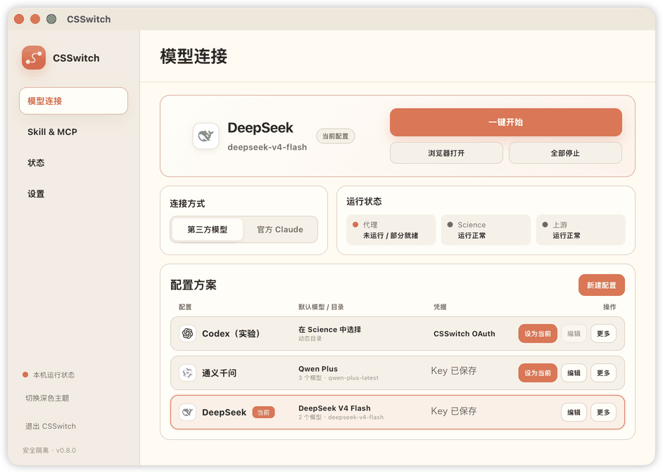

<p align="center">
  
</p>

<p align="center">
  <a href="./LICENSE">MIT License</a> · <strong>CSSwitch v0.8.0</strong> · macOS Apple Silicon · Tauri 2
</p>

<p align="center">
  CSSwitch 让 Claude Science 接入你自己的模型 API。<br>
  在主流 Provider、Codex 与自定义兼容端点之间自由切换。
</p>

<p align="center">
  
</p>

---

<p align="center">
  <a href="https://github.com/SuperJJ007/CSSwitch/releases/download/v0.8.0/CSSwitch_0.8.0_aarch64.dmg">下载 v0.8.0</a> ·
  <a href="#安装与启动">安装与启动</a> ·
  <a href="#provider-与模型">Provider 与模型</a> ·
  <a href="#skill--mcp">Skill &amp; MCP</a> ·
  <a href="./README.en.md">English</a>
</p>

## 安装与启动

需要一台 Apple Silicon Mac、已安装的 [Claude Science](https://claude.com/download)，以及可用的第三方模型 API Key 或 Codex 账号。

1. 下载 [`CSSwitch_0.8.0_aarch64.dmg`](https://github.com/SuperJJ007/CSSwitch/releases/download/v0.8.0/CSSwitch_0.8.0_aarch64.dmg)，将 CSSwitch 拖入「应用程序」。
2. 新建配置，填写 API Key、模型名称和必要的 `base_url`。
3. 点击「设为当前」，再点击「一键开始」。
4. 在 Science 顶部模型选择器中选择需要的模型。

> 当前发布包采用 ad-hoc 签名且未公证。首次打开如被 macOS 阻止，请在 Finder 中右键 CSSwitch 并选择「打开」。

## Provider 与模型

- **内置 Provider：** DeepSeek、通义千问、智谱 GLM、小米 MiMo、硅基流动、Kimi、MiniMax、OpenRouter。
- **自定义端点：** Anthropic Messages、OpenAI Chat Completions 和 OpenAI Responses 兼容 API；模型名称可以直接填写，不依赖自动发现。
- **模型选择：** 普通配置可只填一个模型，也可以分别设置质量、均衡、快速和 Fable。Science 显示真实模型名，不使用 `default` 占位名称。
- **Codex：** 使用 CSSwitch 独立浏览器登录和动态账号模型目录；不读取或修改原生 `~/.codex` 登录。

不同 Provider 对工具调用、thinking、图片、长上下文和流式输出的支持并不相同。CSSwitch 会严格按当前配置映射模型，未知模型不会静默切换到别的模型。

## Skill & MCP

「Skill & MCP」页面展示当前 Science 组织中的真实 Skill、来源和绑定状态，并支持从本地 `.zip` / `.skill` 导入。也可以让 Science 通过 CSSwitch connector 安装固定公开 GitHub URL 中的 Skill。

CSSwitch 只管理自己导入的内容；同名冲突不会覆盖，bundle 卸载需要整包确认。详细合同见[外部 Skill bridge](./docs/features/external-skill-bridge.md)。

## 安全与隔离

- 第三方模式使用独立 HOME、data-dir 和本地回环 Gateway，不读取或修改真实 Claude 登录与 Science 数据。
- API Key 保存在本机 `~/.csswitch/config.json`，文件权限为 `0600`；凭据不会写入日志。
- 官方 Claude 模式会停止第三方代理链路，再打开真实 Science。
- CSSwitch 不下载、固定或自动升级 Claude Science；启动时优先使用当前安装的官方 App。

## 当前边界

- 公开桌面包目前只支持 macOS Apple Silicon。
- 第三方模式不提供 Anthropic 账号权限，托管 MCP、目录连接器和部分云端能力可能不可用。
- Codex 仍是默认关闭的实验能力，当前只支持单账号浏览器登录。
- Rust Gateway 已随应用打包，不需要单独安装 Python runtime。

升级、回滚和已知限制见[项目文档](./docs/README.md)。问题反馈请使用 [GitHub Issues](https://github.com/SuperJJ007/CSSwitch/issues)。

## 开发

```bash
cd desktop
npm install
npm run tauri dev
```

完整检查：

```bash
bash test/run_all.sh
```

[更新日志](./CHANGELOG.md) · [开发与测试](./docs/operations/development.md) · [发布证据](./docs/evidence/releases/README.md)
