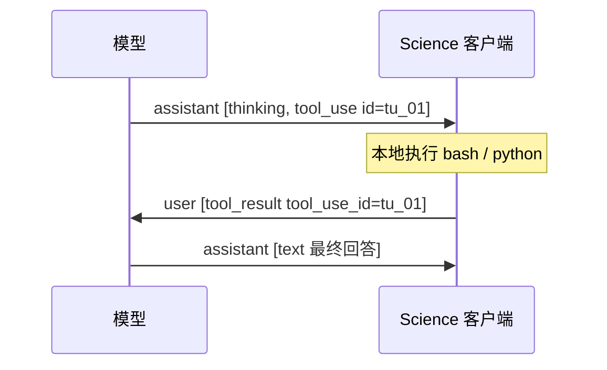
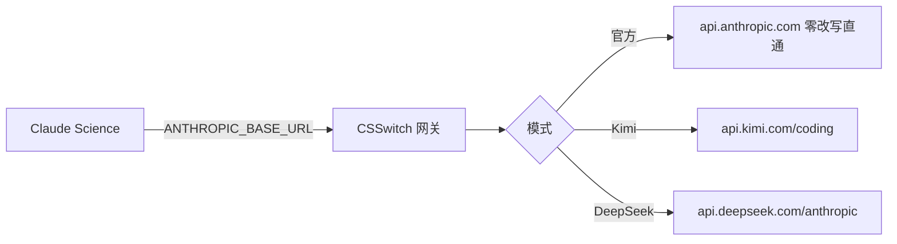
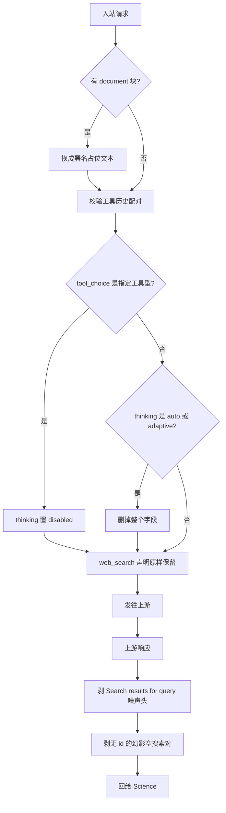

# 消息块的组装与适配

Claude Science 说的是 Anthropic Messages 协议。第三方端点自称"Anthropic 兼容",
但兼容层各有缺口。本文讲清两件事:**Science 到底发出什么形状的消息**,
以及 **CSSwitch 在中间把哪些形状改成了上游能接受的样子**。

---

## 一、Science 发出的消息长什么样

一次请求的 body 是一棵三层的树:

```
请求 body
├── model / max_tokens / stream
├── thinking          ← Science 发非标准的 {"type":"auto"}
├── tools[]           ← 客户端工具与服务端工具混在一起
├── tool_choice       ← 多数轮次不带;分类器调用带 {"type":"tool"}
└── messages[]        ← 完整历史,每轮都要重发一遍
    └── content[]     ← 块的数组,全部复杂度所在
```

关键认知:**API 是无状态的**。服务端不记得上一轮,`messages[]` 每次都要带上完整
历史。所以历史里任何一处结构损坏,都不是"这一轮失败",而是**此后每一轮都失败**。

### content[] 里会出现的块

| 块类型 | 谁产生 | 用途 |
| --- | --- | --- |
| `text` | 双方 | 普通文本 |
| `thinking` | 模型 | 推理过程,带 `signature` |
| `tool_use` | 模型 | 请求调用客户端工具,带 `id` |
| `tool_result` | 客户端 | 工具执行结果,带 `tool_use_id` |
| `server_tool_use` | 模型 | 请求服务端执行(如 web_search) |
| `web_search_tool_result` | **服务商** | 服务端搜索结果 |
| `image` | 客户端 | 图片 |
| `document` | 客户端 | PDF 等附件 —— **Science 的平台视觉通道** |

### 工具调用横跨两条消息



`tool_use.id` 与 `tool_result.tool_use_id` **必须一一配对**。第三方端点内部会把
消息转成 OpenAI 格式,那边的 `tool_call_id` 配对是硬约束,落单直接 400。

服务端工具不同:它由**服务商执行**,客户端只是旁观者,两个块都落在 assistant 消息里:

```
assistant: [ server_tool_use id=srv_01 name=web_search input={query},
             web_search_tool_result tool_use_id=srv_01 content=[...] ]
```

---

## 二、CSSwitch 在中间做了什么



官方模式**逐字节直通**,不做任何补偿——官方 API 就是协议本身,没有缺口可补。
第三方模式才进入补偿链。

补偿有三条铁律:

- **窄**:只改上游确实会拒收的组合,能过的原样送;
- **可见**:每条补偿有规则 ID,日志里能看到哪条生效;
- **失败显式**:补不了就把上游错误原样交回,不伪造成功。

---

## 三、Kimi 的适配



### 1. `thinking: auto` 让 K3 静默不思考

上游**不报错**,只是不思考——这才是它危险的地方。实测(同一问题,只改这个字段):

| 模型 | 省略字段 | `auto` | `adaptive` | `enabled` |
| --- | --- | --- | --- | --- |
| **k3** | 105 字思考 | **0 字,连块都没有** | **4 字** | 67 字 |
| kimi-for-coding | 126 字 | 104 字 | 107 字 | 172 字 |

缺陷只在 K3。补偿是**删掉字段**而不是改写成别的值——因为省略时上游默认就会思考。
`enabled` / `disabled` 连同 `budget_tokens` 原样透传。

> 补充实测:删字段不等于"继承上一轮"。API 无状态,前一个请求显式 `disabled`
> 之后,下一个省略字段的请求照样思考。

### 2. 指定工具型 `tool_choice` 与思考冲突

`{"type":"tool","name":"X"}` 在思考开启时返回
`400 tool_choice 'specified' is incompatible with thinking enabled`。
由于上游思考默认开启,**即使完全不带 thinking 字段也会失败**。

Science 的工作项分类器正是这个形状,每建一个工作项触发一次。补偿:保留强制工具
(分类器要的是结构化输出),这一轮放弃思考。

实测边界很窄——`auto` 与 `any` 完全正常,只有指定工具型冲突:

| tool_choice | k3 响应 |
| --- | --- |
| 不带 / `auto` / `any` | 200,`[thinking, tool_use]` |
| `{"type":"tool"}` | **400** |

### 3. web_search:原生透传 + 历史配对修复

历史成因是 429:只要**声明了却没实际搜索**就返回 429,而 Science 每轮都声明它。
2026-08-19 复测 32 次**未再复现**,原先 920 行的客户端工具桥已退役,
`web_search_20250305` 现在原样透传。

真实 Science 还会把 `compute snapshot` 机器上下文作为独立 user message 追加在
真实问题之后。Kimi 原生搜索会把最后一条 user 当作查询主题。请求侧规则
`provider.kimi.science-context-tail-reorder` 仅在 typed web_search、尾部双 user、
末条 text-only 且同时命中 `compute snapshot`、独立词 `cores` 与 RAM/带数字 GiB
容量规格时交换两条完整消息；上下文与真实问题原文都不改。普通连续 user、工具结果、
client tool、DeepSeek 与 Generic 均不重排。

但搜索结果**送回历史**这一步会坏,根因是配对断裂:

```
m3/assistant: web_search_tool_result = srvtoolu_da2nr326…
m3/assistant: tool_use              = tool_lATdsqlOGD0n…
m4/user:      tool_result           = tool_lATdsqlOGD0n…
                ↑ 同一条消息里没有任何 server_tool_use
```

Science 落盘时只留结果块、丢掉请求块,而 Kimi 要求这一对能配上,于是回
`400 tool_call_id  is not found` —— 一次搜索让此后每一轮都失败。
(另一种形态:两块都在,但 Kimi 自己发的两个 id 本就不同。)

修复是让这一对配得上:孤儿结果块前面补一个同 id 的 `server_tool_use`;
id 不匹配就对齐到最近的那个;**连 id 都没有的孤儿**(幻影空搜索对落盘的产物)
空内容直接删、有内容合成配对键。规则 `provider.kimi.web-search-result-pairing-repair`。
选补块而非丢块,是为了保住这一轮的搜索证据。

响应侧有三条整形(`kimi_search_noise.rs`):剥离上游注入的
`Search results for query:` 噪声头 text 块;剥离"两半都无键 +
空内容结果块"的幻影对——后者正是无 id 孤儿的源头;以及**配对键采钥**——
真实搜索对放行前把 `server_tool_use.id` 改写为同对结果块的 `tool_use_id`
(只采用上游已有的键),让 Science 能正常落盘配对,新轮次不再依赖请求侧修复。
被吞的块不占输出索引,未命中流量字节级零改写。上游成因、危害与真机证据见
[Kimi 渠道 §3b/§3c/§3d](features/kimi-channels.md)。

