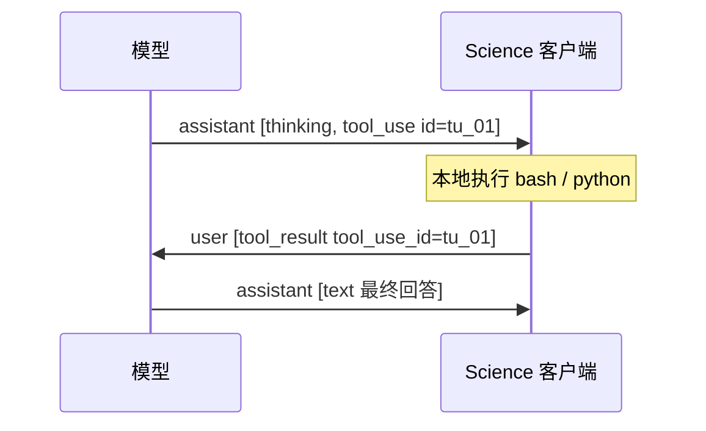
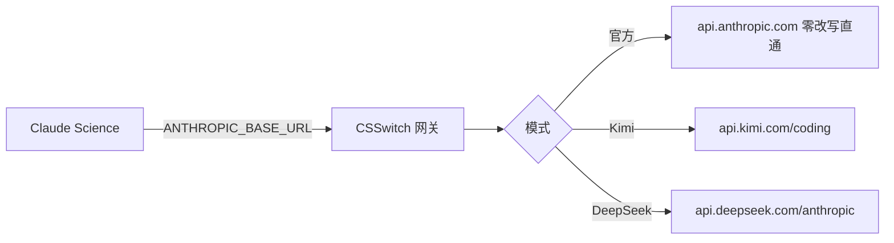
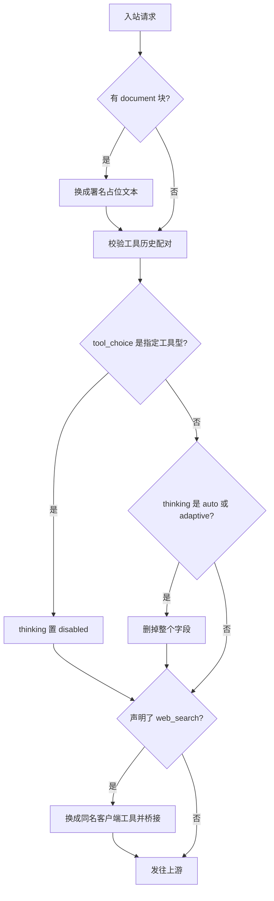
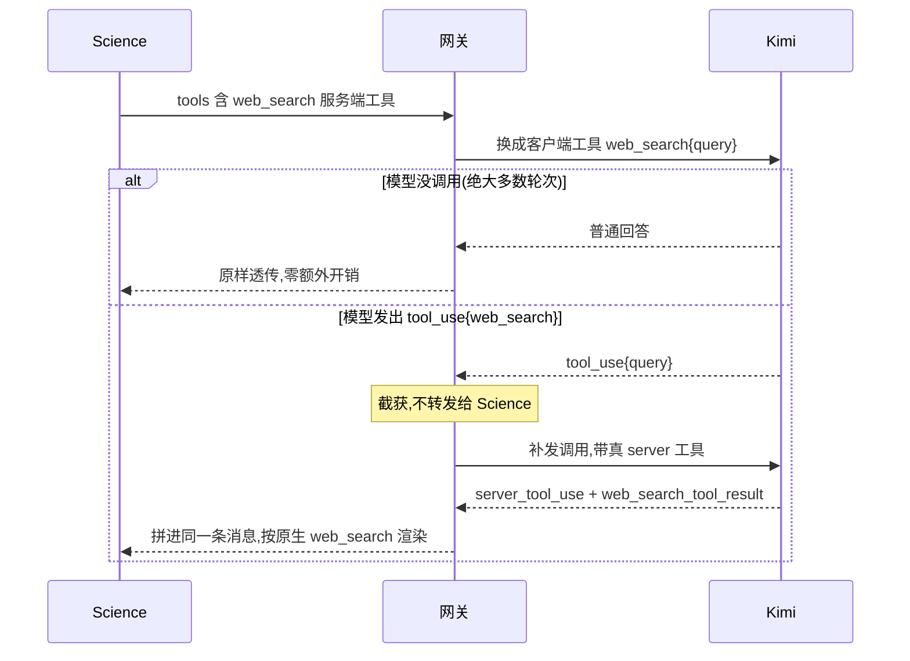
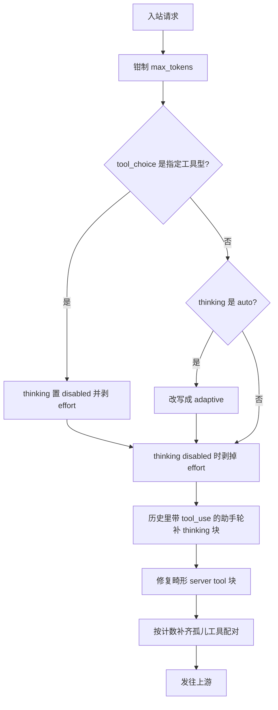

# 消息块的组装与适配

Claude Science 说的是 Anthropic Messages 协议。第三方端点自称"Anthropic 兼容",
但兼容层各有缺口。本文讲清两件事:**Science 到底发出什么形状的消息**,
以及 **CSSwitch 在中间把哪些形状改成了上游能接受的样子**。

---

## 一、Science 发出的消息长什么样

一次请求的 body 是一棵三层的树:

```
请求 body
├── model / max_tokens / stream
├── thinking          ← Science 发非标准的 {"type":"auto"}
├── tools[]           ← 客户端工具与服务端工具混在一起
├── tool_choice       ← 多数轮次不带;分类器调用带 {"type":"tool"}
└── messages[]        ← 完整历史,每轮都要重发一遍
    └── content[]     ← 块的数组,全部复杂度所在
```

关键认知:**API 是无状态的**。服务端不记得上一轮,`messages[]` 每次都要带上完整
历史。所以历史里任何一处结构损坏,都不是"这一轮失败",而是**此后每一轮都失败**。

### content[] 里会出现的块

| 块类型 | 谁产生 | 用途 |
| --- | --- | --- |
| `text` | 双方 | 普通文本 |
| `thinking` | 模型 | 推理过程,带 `signature` |
| `tool_use` | 模型 | 请求调用客户端工具,带 `id` |
| `tool_result` | 客户端 | 工具执行结果,带 `tool_use_id` |
| `server_tool_use` | 模型 | 请求服务端执行(如 web_search) |
| `web_search_tool_result` | **服务商** | 服务端搜索结果 |
| `image` | 客户端 | 图片 |
| `document` | 客户端 | PDF 等附件 —— **Science 的平台视觉通道** |

### 工具调用横跨两条消息



`tool_use.id` 与 `tool_result.tool_use_id` **必须一一配对**。第三方端点内部会把
消息转成 OpenAI 格式,那边的 `tool_call_id` 配对是硬约束,落单直接 400。

服务端工具不同:它由**服务商执行**,客户端只是旁观者,两个块都落在 assistant 消息里:

```
assistant: [ server_tool_use id=srv_01 name=web_search input={query},
             web_search_tool_result tool_use_id=srv_01 content=[...] ]
```

---

## 二、CSSwitch 在中间做了什么



官方模式**逐字节直通**,不做任何补偿——官方 API 就是协议本身,没有缺口可补。
第三方模式才进入补偿链。

补偿有三条铁律:

- **窄**:只改上游确实会拒收的组合,能过的原样送;
- **可见**:每条补偿有规则 ID,日志里能看到哪条生效;
- **失败显式**:补不了就把上游错误原样交回,不伪造成功。

---

## 三、Kimi 的适配



### 1. `thinking: auto` 让 K3 静默不思考

上游**不报错**,只是不思考——这才是它危险的地方。实测(同一问题,只改这个字段):

| 模型 | 省略字段 | `auto` | `adaptive` | `enabled` |
| --- | --- | --- | --- | --- |
| **k3** | 105 字思考 | **0 字,连块都没有** | **4 字** | 67 字 |
| kimi-for-coding | 126 字 | 104 字 | 107 字 | 172 字 |

缺陷只在 K3。补偿是**删掉字段**而不是改写成别的值——因为省略时上游默认就会思考。
`enabled` / `disabled` 连同 `budget_tokens` 原样透传。

> 补充实测:删字段不等于"继承上一轮"。API 无状态,前一个请求显式 `disabled`
> 之后,下一个省略字段的请求照样思考。

### 2. 指定工具型 `tool_choice` 与思考冲突

`{"type":"tool","name":"X"}` 在思考开启时返回
`400 tool_choice 'specified' is incompatible with thinking enabled`。
由于上游思考默认开启,**即使完全不带 thinking 字段也会失败**。

Science 的工作项分类器正是这个形状,每建一个工作项触发一次。补偿:保留强制工具
(分类器要的是结构化输出),这一轮放弃思考。

实测边界很窄——`auto` 与 `any` 完全正常,只有指定工具型冲突:

| tool_choice | k3 响应 |
| --- | --- |
| 不带 / `auto` / `any` | 200,`[thinking, tool_use]` |
| `{"type":"tool"}` | **400** |

### 3. web_search 的 429 与客户端工具桥

上游原生支持 `web_search_20250305`,但只要**声明了却没实际搜索**就返回 429
(引擎过载)。Science 每轮都声明它,于是真实会话每轮都失败。

解法是把服务端工具换成同名的客户端工具——客户端工具从不触发 429:



三条硬约束:客户端 `tool_use` **绝不能泄漏**给 Science(它没有本地执行器,泄漏会
让该轮永久挂起);content block index 必须连续无空洞;补发失败要发终止 SSE error,
不伪造助手内容。

### 4. `document` 块不被接受

上游的兼容层没实现 `document`,四种 source 形态全部 400。决定性对照:一个
**根本不存在的块类型**返回完全相同的报文——说明它走的是"未知块"分支。

这个块是 Science **平台 PDF 视觉通道**的载荷,而且会留在历史里,
**一个附件让此后每一轮都失败**。补偿是换成署名的占位文本,让对话继续。

> 占位文本必须署名。实测中模型引用了未署名的占位文本,被追问来源后
> **把一个正确结论当成自己编造的撤回了**。

---

## 四、DeepSeek 的适配

DeepSeek 走官方 `/anthropic` 端点,协议完整度更高,补偿集中在
**thinking 与历史结构**:



### 与 Kimi 的对照

同一个问题,两家的解法不同,原因是上游行为不同:

| 入站形状 | Kimi | DeepSeek |
| --- | --- | --- |
| `thinking: auto` | 200 但静默不思考 → **删掉字段** | **400 拒收** → 改写成 `adaptive` |
| 指定工具型 `tool_choice` | 400 → 置 `disabled` | 400 → 置 `disabled` + 剥 effort |
| `web_search` 服务端工具 | 429 → **换客户端工具桥接** | 原生可用 → **原样保留** |
| `document` 块 | 400 → 换占位文本 | 接受(但答 `CANNOT_READ`) |
| 历史缺 thinking 块 | 接受 | **400** → 补占位 thinking 块 |

`web_search` 那一行是重点:同一个工具,一家要桥接、一家要保留。**对 DeepSeek 不能
降级成文本**——实测那样会教模型模仿扁平化的写法,后面它开始用纯文本伪造工具调用。

### 历史 thinking 补块:曾经的 BUG-083

DeepSeek 要求**每个带 `tool_use` 的助手轮都必须带 thinking 块**。Anthropic SDK
客户端常常保留工具历史却丢掉 thinking,于是下一轮 400。这就是挂了很久的
"多轮 thinking 返回 400"。

```
历史里的助手轮:
  [tool_use tu_01]                   ← 缺 thinking → 400
  ↓ 补偿
  [thinking(占位), tool_use tu_01]    ← 通过
```

实测:31 条消息的长会话,13 次请求命中 9 次,零失败。补偿是**无状态**的——每轮
重新扫描全部历史再补,所以对话越长命中越频繁,不存在"补一次就失效"。

### 两类历史结构损坏

**孤儿工具配对**——`tool_use` 没有对应结果(流式被打断、daemon 重启、并行调用只回
来一部分),或 `tool_result` 找不到来源(会话恢复、历史压缩把助手轮裁掉了):

```
assistant: [tool_use tu_01]    ← 有请求
user:      [ ]                 ← 没有结果 → 400
```

修复:缺结果的补一条标了 `is_error` 的合成结果;找不到来源的降级成文本。
**按计数而不是按集合**配对——两个 tool_use 共用同一 id 时,集合判断会以为配上了。

**畸形 server tool 块**——Science 的 daemon 会把缺 `tool_use_id` 的
`web_search_tool_result` 落盘进历史,DeepSeek 的反序列化器要求该字段必填。
修复:结构完好的保留,畸形的能抽文本就降级、抽不出就丢弃。

> **证据状态**:这两条是从 cc-switch 语义移植的,**尚未独立实测边界**。
> 真实容忍度可能比假设的宽。

---

## 五、怎么看日志

每次转发都会打一行,`rules=` 后面是本次生效的补偿:

```
POST /v1/messages relay target=k3 stream=true msgs=19 thinking_type=-
  rules=provider.kimi.thinking-upstream-default,
        tool.relay.input-schema-normalize,
        tool.kimi.web_search.client-tool-bridge
```

读法:发往 `k3`,历史 19 条消息,最终 thinking 字段**已被删除**(`-`),
三条规则生效。`rules=-` 表示零改写。

规则日志只记**净效果**:被后续规则覆盖、等于没做的改写不会出现在这里。
所以看到什么,发出去的就是什么。

### 规则 ID 全集

| 规则 | 渠道 |
| --- | --- |
| `provider.kimi.thinking-upstream-default` | Kimi |
| `provider.kimi.specified-tool-choice-disables-thinking` | Kimi |
| `provider.kimi.document-block-placeholder` | Kimi |
| `tool.kimi.web_search.client-tool-bridge` | Kimi |
| `tool.kimi.unsupported-server-tool-filter` | Kimi |
| `provider.deepseek.thinking-auto-adaptive` | DeepSeek |
| `provider.deepseek.specified-tool-choice-disables-thinking` | DeepSeek |
| `provider.deepseek.thinking-disabled-strips-effort` | DeepSeek |
| `provider.deepseek.tool-thinking-history-replay` | DeepSeek |
| `provider.deepseek.malformed-server-tool-block-repair` | DeepSeek |
| `provider.deepseek.orphan-tool-pairing-repair` | DeepSeek |
| `tool.deepseek.web_search.server-tool-preserve` | DeepSeek |
| `tool.deepseek.unsupported-server-tool-filter` | DeepSeek |
| `tool.relay.input-schema-normalize` | 共用 |
| `tool.anthropic.unknown-server-tool-preserve` | 共用 |

---

## 相关文档

- [Kimi 渠道](features/kimi-channels.md) —— 四条补偿的完整实测证据
- [DeepSeek 渠道](features/deepseek-channel.md) —— 六条补偿与 thinking 矩阵
- [架构](architecture.md) —— 边界、数据流、端点合同
- [真机验收清单](../test/LIVE_ACCEPTANCE.md) —— 怎么复现这些场景
